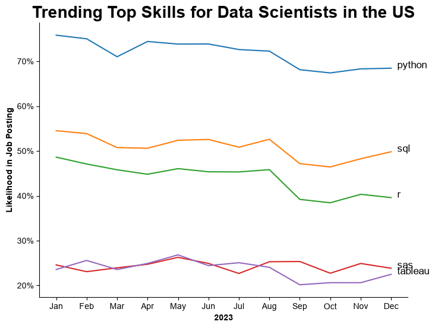
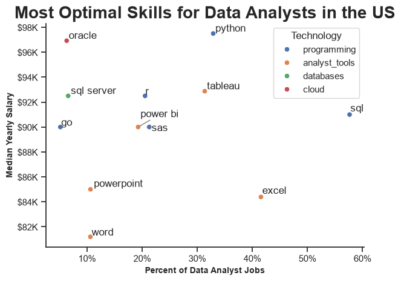

# Analysis Process

## 1. What are the most demanded skills for the top 3 most popular data roles?
To better understand the current job market, I filtered the dataset to include only job postings from the United States. I then identified the three most common data roles and extracted the five most frequently requested skills for each role. This analysis highlights the key skills candidates should prioritize based on the career path they want to pursue.

**Review the complete technical analysis notebook:**

[1_Skill_Demand.ipynb](notebooks/2_Skill_Demand.ipynb)

### Visualize Data

```python
for index, job_title in enumerate(top_titles):
    df_plot = df_skills_prc[df_skills_prc['job_title_short'] == job_title].head(5)

    sns.barplot(
        data=df_plot,
        x='skill_percentage',
        y='job_skills',
        ax=ax[index],
        hue='skill_count',
        palette='dark:b_r'
    )

    ax[index].legend().set_visible(False)
    ax[index].set_ylabel("")
    ax[index].set_xlabel("")
    ax[index].set_title(job_title, weight='bold', fontsize=16)
    ax[index].set_xlim(0, 78)

    for n, v in enumerate(df_plot['skill_percentage']):
        ax[index].text(v + 1, n, f'{v:.0f} %', va='center')

    if index != 2:
        ax[index].set_xticks([])
```
### Results


### Insights

- **Python** is the most versatile skill across the three data roles. It appears in **72%** of Data Scientist job postings and **65%** of Data Engineer postings, making it one of the most valuable technical skills in the current job market.

- **SQL** is another fundamental skill required across all three roles. More than half of the job postings for each role mention SQL, with **68%** of Data Engineer positions requiring it, highlighting its importance for working with and managing data.

- **Data Engineers** are expected to possess more specialized technical skills than the other roles. Technologies such as **AWS, Azure, and Spark** appear frequently in job requirements, reflecting the infrastructure and big data responsibilities associated with the role.

- **Data Analysts** are more likely to require **Excel** than **Python**, whereas the opposite is true for **Data Scientists**. This reflects the different responsibilities of each role. Data Analysts primarily focus on querying data, analyzing business performance, and creating reports and dashboards, while Data Scientists are expected to build predictive models and apply machine learning techniques, making programming skills more essential.

---

## 2. How Are In-Demand Skills Trending for Data Scientists in the United States?

To analyze skill trends throughout 2023, the dataset was first filtered to include only **Data Scientist** job postings in the **United States**.

The job posting date was then used to extract the posting month, and the frequency of each skill was calculated for every month. Instead of using raw counts, the percentage of job postings containing each skill was computed. This normalization accounts for differences in the total number of job postings each month, making it easier to compare skill demand over time and identify the most valuable skills to learn for those who want to become Data Scientist.

**Review the complete technical analysis notebook:**
[3_Skill_Trend.ipynb](notebooks/3_Skill_Trend.ipynb)


### Visualize Data
```python
from matplotlib.ticker import PercentFormatter
df_plot=df_percent.iloc[:12, :5]

plt.figure(figsize=(8,6))
sns.lineplot(data=df_plot, dashes=False, palette='tab10')
sns.set_theme(style='ticks')
sns.despine()

plt.gca().yaxis.set_major_formatter(PercentFormatter())
plt.title('Trending Top Skills for Data Scientists in the US', weight='bold', fontsize=20)
plt.ylabel('Likelihood in Job Posting',weight='bold')
plt.xlabel('2023',weight='bold')
plt.legend().remove()


# annotate the plot with the top 5 skills using plt.text()
for i in range(5):
    plt.text(11.2, df_plot.iloc[-1, i], df_plot.columns[i], color='black')
plt.show()
```
### Results


### Insights

- Python remained the most in-demand skill throughout 2023, appearing in approximately 76% of Data Scientist job postings at the beginning of the year. Although its demand declined by about 5–7 percentage points over the year, it consistently remained the most requested skill, highlighting its importance in the Data Scientist role.

- Most skills reached their highest demand during January, May, and June, while demand gradually declined toward the end of 2023.

- Unlike Python, SQL, and R, the demand for SAS remained relatively stable throughout 2023, showing only minor fluctuations across the months.

- Although the percentage of job postings changed over time, the ranking of the most in-demand skills remained largely unchanged throughout 2023.

---
## 3. How well are Data Analysts paid based on job roles and skills in the United States?
The dataset was first filtered to include only job postings from the United States. Next, it was filtered for the six most in-demand data roles to compare their salary distributions.

The analysis then focused specifically on Data Analyst positions. The Data Analyst dataset was explored from two perspectives: the most in-demand skills and the highest-paying skills, to identify which skills are high paid and which high demand in the market and salary potential.

**Review the complete technical analysis notebook:**

[4_Salary_Analysis.ipynb](notebooks/4_Salary_Analysis.ipynb)

---
### 1. Salary Distribution Across the Top Six Data Roles
#### Objective

Observe the differnc between salary distributions of the six most common data-related job roles in the United States to understand differences in salary ranges, medians, and variability.

#### Visualize Data

```python
plt.figure(figsize=(8,5))
sns.set_theme(style='ticks')
sns.boxplot(data=df_US_top6j, x='salary_year_avg', y='job_title_short', order=job_order, color='royalblue' )

plt.title("Salary Distributions in the US ", weight='bold', fontsize=20)
plt.xlabel('Yearly Salary (USD)',weight='bold' )
plt.ylabel("")
plt.xlim(0, 600000)
ax=plt.gca()
ax.xaxis.set_major_formatter(plt.FuncFormatter(lambda x, pos: f"${int(x/1000)}K"))
plt.tight_layout()
plt.show()
```

#### Results


#### Insights

- Senior Data Scientist has the highest median salary among the six roles, followed closely by Senior Data Engineer.

- Although senior positions generally have higher median salaries than the non-senior counterparts, this pattern is not consistent across all data roles. For example, the median salary of Senior Data Analysts is lower than that of both Data Scientists and Data Engineers.

- All six roles show wide salary ranges and numerous outliers, indicating substantial variation in compensation within each role.

---

### 2. Highest Paid and Most Demanded Skills for Data Analysts

#### Objective

Compare the most in-demand and highest-paying skills for Data Analysts in the US to identify valuable skills based on both market demand and median salary.

#### Visualize Data

```python
fig, ax= plt.subplots(2,1, figsize=(8,5))
sns.set_theme(style='ticks')

#top demands
sns.barplot(data=df_DA_top_demand, y=df_DA_top_demand.index,x='median_sal', ax=ax[0], palette ='light:b_r' )

ax[0].set_title("Most Demanded Skills for Data Analysts in the US", fontsize=18, weight='bold')
ax[0].set_ylabel("")
ax[0].set_xlabel("Median Salary", weight='bold')
ax[0].xaxis.set_major_formatter(plt.FuncFormatter(lambda x,po: f"${int(x/1000)}K"))

#top paid 
sns.barplot(data=df_DA_top_pay, y=df_DA_top_pay.index,x='median_sal', ax=ax[1], palette = 'light:b_r')


ax[1].set_title("Top Paid Skills for Data Analysts in the US", fontsize=18 , weight='bold')
ax[1].set_ylabel("")
ax[1].set_xlabel("Median Salary",weight='bold' )
ax[1].xaxis.set_major_formatter(plt.FuncFormatter(lambda x,po: f"${int(x/1000)}K"))


ax[0].set_xlim(ax[1].get_xlim())
plt.tight_layout()
plt.show()
```

#### Results


#### Insights
- The most demanded skills are generally associated with lower median salaries than the highest-paying specialized skills. For example, Python, the most in-demand skill, has a median salary of approximately $100K, while Dplyr, the highest-paying skill, has a median salary of around $200K—roughly twice as much. This suggests a trade-off between market demand and salary potential, where niche skills often command higher compensation.

- Tableau, Power BI, and Excel have very similar median salaries while also ranking among the most demanded skills for data analysts. This indicates that employers place comparable value on these business intelligence and spreadsheet tools.

- Tableau, Power BI, and Excel are both highly demanded and competitively paid, highlighting the importance of data visualization, reporting, and business analytics skills in the data analyst role.

- Specialized technologies such as Dplyr, Bitbucket, and GitLab are among the highest-paying skills, with median salaries ranging from approximately $190K to $200K. Although these skills are not among the most frequently requested, they offer significantly higher salary potential.
---


## 4. What Are the Most Optimal Skills for Data Analysts in the United States to Learn?

The dataset was filtered to include only **Data Analyst** job postings in the **United States**. The demand for each skill was calculated as the percentage of job postings requiring that skill, while the median salary associated with each skill was also determined.

By combining skill demand with median salary, the analysis identifies the most valuable skills to learn. Those that provide a strong balance between employment opportunities and earning potential.

To provide additional context, each skill was categorized by its corresponding technology (e.g., Programming, Databases, Business Intelligence, Cloud, and Analyst Tools). These categories were incorporated into the visualization to highlight technology trends and help learners understand which technology areas contribute most to high-demand and high-paying Data Analyst skills.

**Review the complete technical analysis notebook:**
[5_Optimal_Skills.ipynb](notebooks/5_Optimal_Skills.ipynb)


### Visualize Data

```python
sns.scatterplot(
    data=df_DA_skills_tech_high_demand,
    x='skill_percentage',
    y='median_sal',
    hue='technology'
)

sns.despine()
sns.set_theme(style='ticks')

# Prepare texts for adjustText
texts = []
for i, txt in enumerate(df_DA_skills_high_demand.index):
    texts.append(plt.text(df_DA_skills_high_demand['skill_percentage'].iloc[i], df_DA_skills_high_demand['median_sal'].iloc[i], txt))

# Adjust text to avoid overlap
adjust_text(texts, arrowprops=dict(arrowstyle='->', color='gray'))

# Set axis labels, title, and legend
plt.xlabel('Percent of Data Analyst Jobs',weight='bold', fontsize=10)
plt.ylabel('Median Yearly Salary',weight='bold', fontsize=10)
plt.title('Most Optimal Skills for Data Analysts in the US',weight='bold', fontsize=20)
plt.legend(title='Technology', weight='bold')

from matplotlib.ticker import PercentFormatter
ax = plt.gca()
ax.yaxis.set_major_formatter(plt.FuncFormatter(lambda y, pos: f'${int(y/1000)}K'))
ax.xaxis.set_major_formatter(PercentFormatter(decimals=0))

# Adjust layout and display plot 
plt.tight_layout()
plt.show()
```

### Results



### Insights

- Programming languages and analyst tools account for most of the highly demanded skills among Data Analysts. This indicates that employers value both technical analysis skills (e.g., Python, SQL, and R) and business intelligence tools (e.g., Tableau, Power BI, and Excel) for analyzing, visualizing, and communicating data effectively.

- Python is the most valuable skill to learn, combining the highest demand (over 30% of job postings) with a competitive median salary of approximately $98K. This makes it the strongest overall skill based on both demand and salary. 

- Tableau and SQL rank among the next most valuable skills after Python. Their combination of high demand and competitive salaries makes them excellent skills to learn for aspiring Data Analysts.

- The most optimal skills are not necessarily the highest-paying skills. Instead, they provide the best balance between market demand and salary, making them practical choices for individuals seeking strong employment opportunities and competitive compensation.


---
