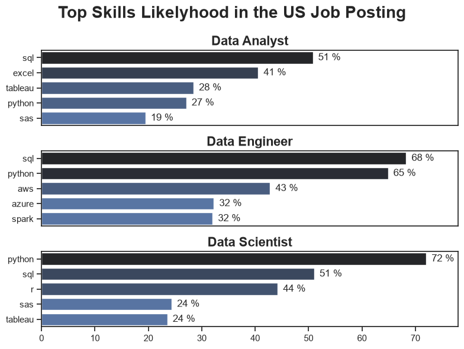
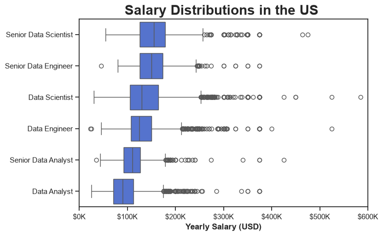
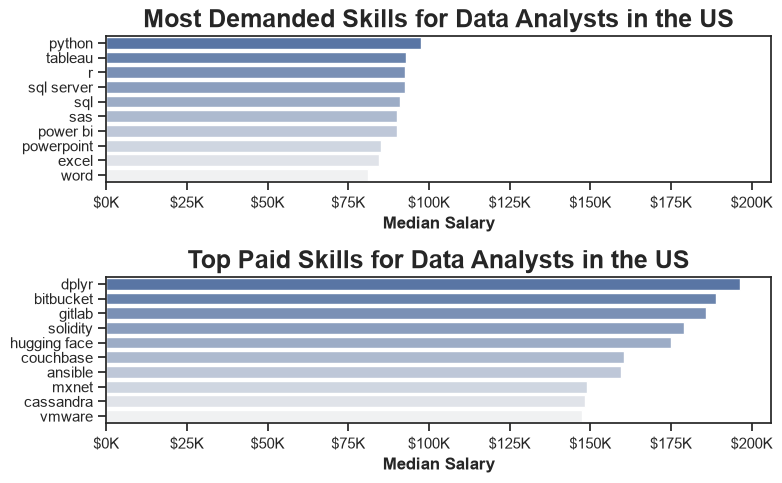

# Analysis Process

## 1. What are the most demanded skills for the top 3 most popular data roles?
To better understand the current job market, I filtered the dataset to include only job postings from the United States. I then identified the three most common data roles and extracted the five most frequently requested skills for each role. This analysis highlights the key skills candidates should prioritize based on the career path they want to pursue.

**Review the complete technical analysis notebook:**

[1_Skill_Demand.ipynb](notebooks\2_Skill_Demand.ipynb)

### Visualize Data

```python
for index, job_title in enumerate(top_titles):
    df_plot = df_skills_prc[df_skills_prc['job_title_short'] == job_title].head(5)

    sns.barplot(
        data=df_plot,
        x='skill_percentage',
        y='job_skills',
        ax=ax[index],
        hue='skill_count',
        palette='dark:b_r'
    )

    ax[index].legend().set_visible(False)
    ax[index].set_ylabel("")
    ax[index].set_xlabel("")
    ax[index].set_title(job_title, weight='bold', fontsize=16)
    ax[index].set_xlim(0, 78)

    for n, v in enumerate(df_plot['skill_percentage']):
        ax[index].text(v + 1, n, f'{v:.0f} %', va='center')

    if index != 2:
        ax[index].set_xticks([])
```
### Results



### Insights

- **Python** is the most versatile skill across the three data roles. It appears in **72%** of Data Scientist job postings and **65%** of Data Engineer postings, making it one of the most valuable technical skills in the current job market.

- **SQL** is another fundamental skill required across all three roles. More than half of the job postings for each role mention SQL, with **68%** of Data Engineer positions requiring it, highlighting its importance for working with and managing data.

- **Data Engineers** are expected to possess more specialized technical skills than the other roles. Technologies such as **AWS, Azure, and Spark** appear frequently in job requirements, reflecting the infrastructure and big data responsibilities associated with the role.

- **Data Analysts** are more likely to require **Excel** than **Python**, whereas the opposite is true for **Data Scientists**. This reflects the different responsibilities of each role. Data Analysts primarily focus on querying data, analyzing business performance, and creating reports and dashboards, while Data Scientists are expected to build predictive models and apply machine learning techniques, making programming skills more essential.

---

## 2. What are the most demanded skills for the top 3 most popular data roles? 
overview:......

**Review the complete technical analysis notebook:**
[2_Skill_Trend.ipynb](notebooks\3_Skill_Trend.ipynb)
### Visualize Data

```python
# Your plotting code
```

### Results


### Insights

- 
- 
- 
- 

---
## 3. How well are Data Analysts paid based on job roles and skills?
**Review the complete technical analysis notebook:**

[Salary_Analysis.ipynb](notebooks/4_Salary_Analysis.ipynb)

---
### 1. Salary Distribution Across the Top Six Data Roles
#### Objective

Compare the salary distributions of the six most common data-related job roles in the United States to understand differences in salary ranges, medians, and variability.

#### Visualize Data

```python
# Add your plotting code here
```

#### Results



#### Insights

- Highest median salary:
- Lowest median salary:
- Roles with the widest salary range:
- Roles with the narrowest salary range:
- Presence of outliers:
- Key takeaway:

---

### 2. Highest Paid and Most Demanded Skills for Data Analysts

#### Objective

Compare the most in-demand Data Analyst skills with their median salaries to identify skills that offer the best combination of demand and compensation.

#### Visualize Data

```python
# Add your plotting code here
```

#### Results



#### Insights

- Highest-paying skill:
- Most demanded skill:
- Skills that provide both high demand and high salary:
- Interesting observations:
- Key takeaway:

---

## 4. Your Analysis Question

Briefly explain what this analysis aims to investigate and why it is important.

**Review the complete technical analysis notebook:**
[5_Optimal_Skills.ipynb](notebooks\5_Optimal_Skills.ipynb)

### Visualize Data

```python
# Your plotting code
```

### Results


### Insights

- 
- 
- 
- 

---